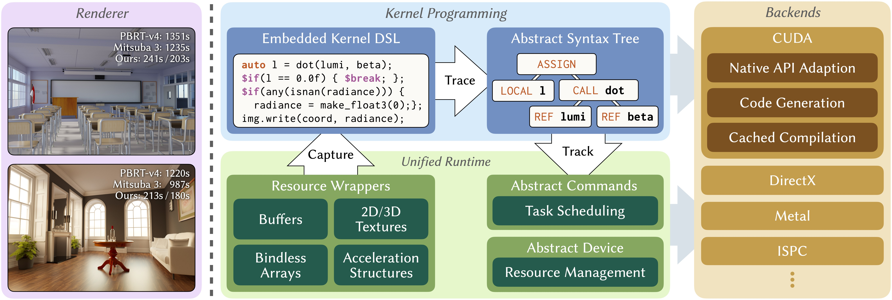

# 简介
## 什么是Luisa Compute
Luisa Compute（简称LC）是一个跨平台（Linux，Windows, MacOS)，多计算后端（CUDA, DirectX-12, Metal），多语言前端（C++, Python, Rust）的高性能并行计算框架。其入门门槛低，开发方式简单，可广泛应用于离线/实时渲染器，物理模拟等领域。

## 为什么要使用Luisa Compute
传统的开发模式通常是直接编写CUDA，HLSL等GPU语言，编译后在Host端（如CPU）手动加载和调用。一方面，这种编码方法欠缺动态性，只有调用编译时传入不同参数并在内部使用预编译宏才能获得不同变体（Variant）；另一方面，常见的图形API如DirectX, Vulkan等通常为了可操作性暴露大量底层细节，对学习者而言门槛较高的同时，也使用户在开发时稍不注意就容易写出错误的或低效率的实践。这套解决方案的设计，意在解决上述的问题，Luisa一词意为Layered and Unified Interfaces on Stream Architectures，即层级化的，统一的，针对流处理器架构所设计的计算接口。在计算代码的编写方面，采用DSL（领域特定语言）+ 代码生成的方式，在原生语言上实现了一层表达力更强，更加动态的语言前端，这让用户不再需要通过原始的预编译宏，而是使用更高级的元编程控制自己的编译流程。同时运行时（runtime）的调度管线，也会对提交的任务进行动态调度优化，这通常比人工编写的调度方法方便，且效率更高，同时这套运行时系统与DSL语言前端紧密结合，让用户更少的为可能的大意浪费时间或为琐碎的优化问题烦恼，更容易写出优雅且高效的解决方案。

## 谁在使用Luisa Compute

